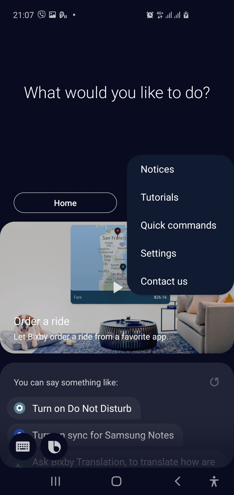
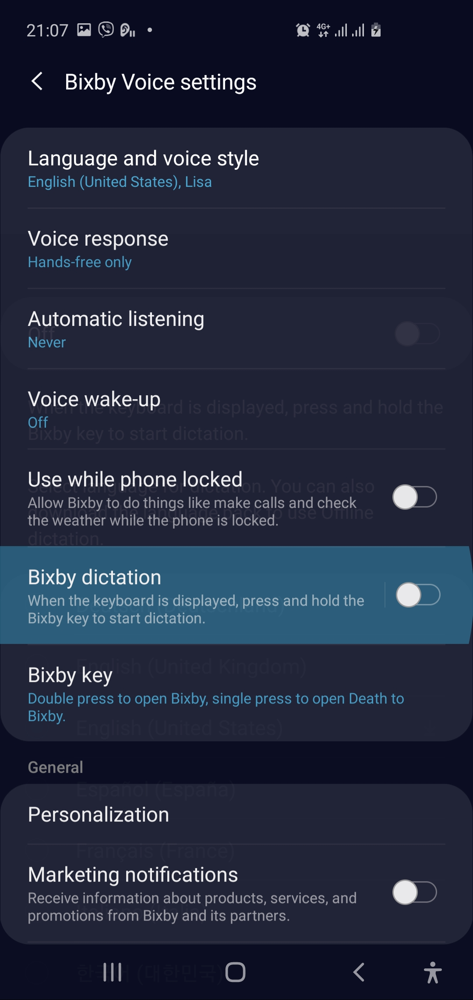
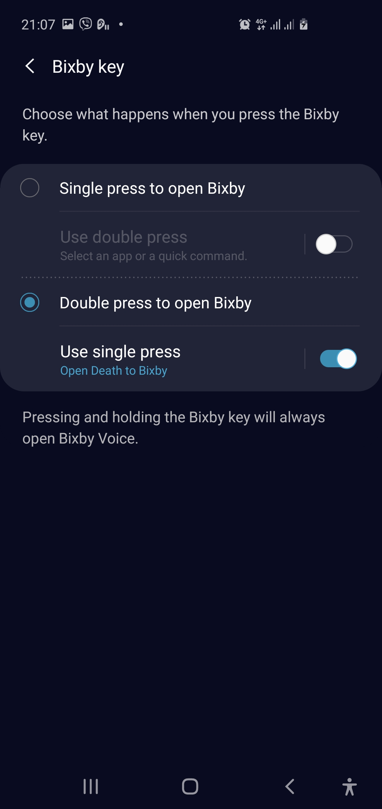

# Death to Bixby

This app purpose is to be headless app without UI and quits instantly.

# Prerequisites

- Android 9 and 10

# Getting started

Build app and install it on your device.

This app is intended for any Bixby assistant in order to disable it.

# Install

Run app from Android Studio or install apk manually.
Open Bixby by touching the Bixby button.

1. Make sure Bixby is up to date, because Samsung is forcing you to update
even if you don't use it.
And make sure you unfortunately have Samsung valid account and you have
unlawfully accepted the term and policies (just to disable the app) 

2. Open the settings

3. Set to Double click

4. Choose app and find our app

# Why

1. Samsung's support doesn't listen their customers that Bixby button is
annoying and never needed.

2. Playing games again aren't you, decreasing your Volume you are,
but no Bixby opens and you lose game progress.

# Tested on devices

- Samsung Galaxy S10

# Releases

Use the releases tab to download prebuilt Android Apk
